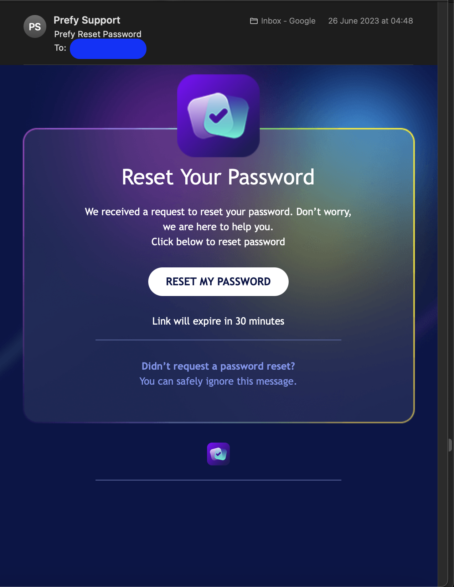
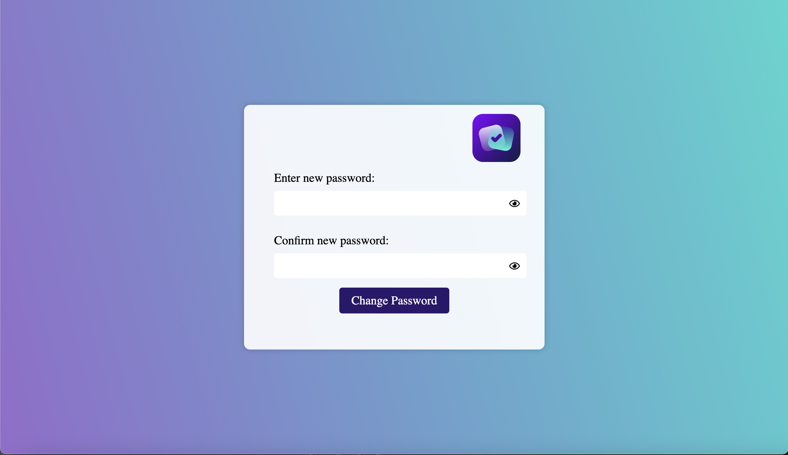

# Prefy Backend

A Spring Boot backend service for Prefy - an android application that was previously on the google play store.

Works seamlessly with the Prefy Android app: [Prefy](https://github.com/NotDari/Prefy-Android)  
and the Prefy Admin android app: [Prefy God](https://github.com/NotDari/Prefy-God).

## Note from the Developer

This project was developed in 2023, prior to major formal coding education, when I was coding mostly self taught.  
At the time, my coding practices were far inferior to the present day, and I would do things differently if made today.

This project was a major milestone in my early development journey. 
It helped me learn Spring Boot from scratch, and through reflection, 
I can now see opportunities to improve code consistency, testing, 
and scalability. These improvements have been applied in some of my later projects.


## Feature overview

- User authentication and authorization with JWT tokens for repeated log in
- Increased security with google play integerity service
- Password reset with time-limited tokens
- Posts with votes and comments
- Accounts with following other users enabled
- User suggestions and reporting
- Database access via Spring Data JPA
- Support Emails and password reset forms
- Admin/Bot functionality with scripted voting
- Custom error responses

## Getting started

### How to start

- Java 17
- Maven
- MySQL or compatible database

In addition you need to configure several files:
- daribear.p12
- application.properties 

You also need to create the following environment variables:
- SERVER_HOST
- SERVER_PORT

### Clone the Repository

```bash
git clone https://github.com/NotDari/Prefy-Backend.git
cd Prefy-Backend
```


## Issues

There are several issues with the project, some of which are due to my previous lack of coding knowledge:
- No tests in the project
- Inconsistent style(especially with dependancy injection)


## Images of use

These are two examples of the example uses. 

On the left is the password reset email,
which is one example of an email sent to the user.

On the right is the webpage shown when the user clicks the reset link,
and it has full Javascript validation to ensure they choose a valid password.
<table>
<tr>
  <td align="center">
    <br/>
    <b>Password reset email</b>
  </td>
  <td align="center" >
    <br/>
    <b>Password reset form</b>
  </td>
</tr>
</table>
